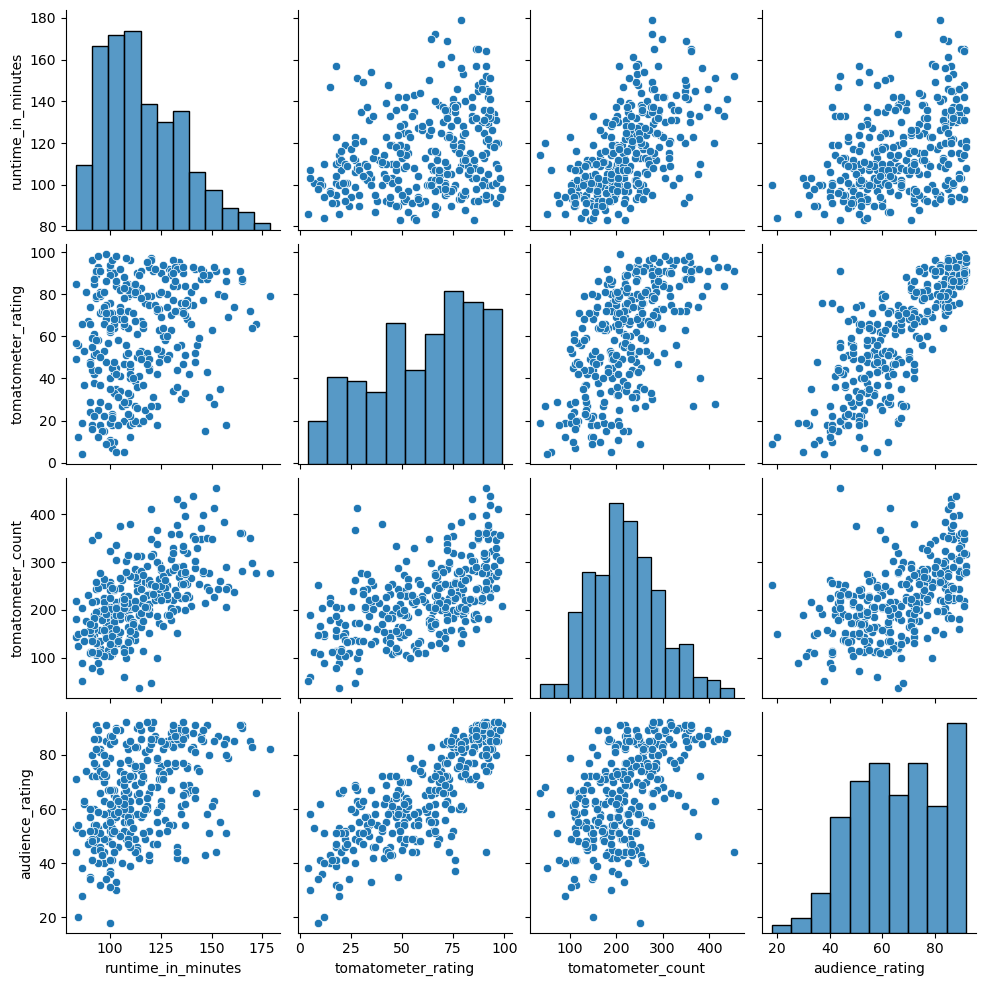

&nbsp;

&nbsp;

# Projects:

## Movie Review
Use Python and Pandas to explore data on movie reviews.

## Movie Streaming Service
Use data science to determine how to reduce customer churn for a music streaming service.

Shown here: pair plot to determine correlation between various metrics of the customer data.

